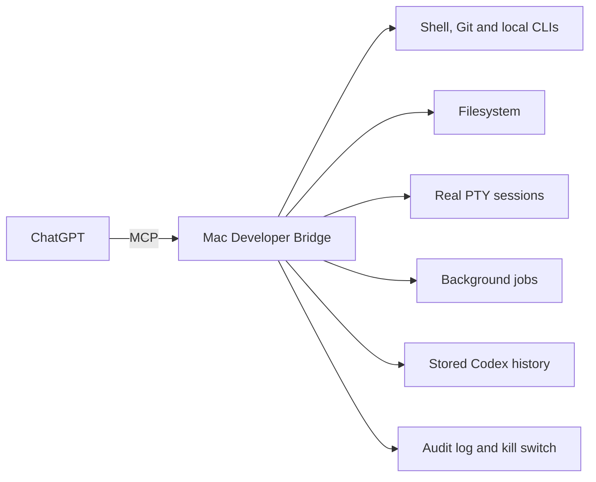

# Mac Developer Bridge

### Give ChatGPT a real terminal on your Mac.

[](https://github.com/alexanderradahl/mac-developer-bridge/actions/workflows/ci.yml)
[](LICENSE)

Mac Developer Bridge turns a ChatGPT conversation into the reasoning layer for your actual Mac. It can run shell commands, edit files, start interactive terminal sessions, manage long-running jobs, read stored Codex threads without starting another Codex model turn, and optionally operate your real logged-in Chrome tabs **in the background without stealing focus**.


> **Example:** “Find the Codex session I was working on yesterday, inspect the live repo, fix CI, push the result, and tell me what changed.”

That is the kind of workflow this project is built for.

> [!WARNING]
> Mac Developer Bridge deliberately gives an MCP client the effective permissions of your macOS user. It is **not sandboxed** and has no command or path allowlist. Read [SECURITY.md](SECURITY.md) before enabling it.

## The idea

ChatGPT has the reasoning. Your Mac has the source code, terminal, credentials, build tools, local services, and work in progress. Mac Developer Bridge connects the two over MCP without adding another model or agent loop in the middle.



The bridge itself makes no OpenAI model call. It exposes deterministic local tools; ChatGPT supplies the reasoning. The Codex-history tools use read-only `codex app-server` methods and never call `turn/start`.

### What this unlocks

- Recover a stored Codex thread, inspect the repo it refers to, and continue the work from ChatGPT.
- Run tests, builds, Git, package managers, database CLIs, AppleScript, and other tools already installed on your Mac.
- Keep interactive shells and terminal programs alive through a real PTY instead of pretending stdin is a terminal.
- Start long-running local jobs, inspect their logs later, and stop the whole process group.
- Read and modify files anywhere your macOS user can access.
- Optionally operate approved pages in your real logged-in Chrome profile without bringing Chrome to the foreground.

This is intentionally different from a local coding agent. There is no second reasoning loop. ChatGPT remains the agent; the Mac is the execution environment.

## Quick start

For a personal ChatGPT account, the menu-bar app is the easiest path. You need macOS, Node.js 18+, `cloudflared`, a hostname/tunnel, and ChatGPT Developer mode.

```bash
git clone https://github.com/alexanderradahl/mac-developer-bridge.git
cd mac-developer-bridge
./menubar/build.sh
open /Applications/MacDevBridge.app
```

Use **Start**, then **Copy ChatGPT Setup** from the menu-bar app. The detailed OAuth and Cloudflare setup is in [Connecting to ChatGPT](#connecting-to-chatgpt) and [DEPLOY.md](DEPLOY.md).

Workspace users who have access to OpenAI Secure MCP Tunnel can use `install.sh` instead. See [Transports](#transports).

Want to see what to ask it to do? Start with the [copy-paste workflows](examples/README.md).

If this is useful, star the repo so other developers can find it. If you build something interesting with it, share the exact workflow in [What are you making ChatGPT do on your Mac?](https://github.com/alexanderradahl/mac-developer-bridge/discussions/3).

This is an independent open-source project and is not an official OpenAI or Cloudflare product. OpenAI, ChatGPT, Codex, and Cloudflare are trademarks of their respective owners.

## Open source

Mac Developer Bridge is released under the [MIT License](LICENSE). Bug reports and focused pull requests are welcome; see [CONTRIBUTING.md](CONTRIBUTING.md). Security-sensitive reports should follow the guidance in [SECURITY.md](SECURITY.md) rather than being posted publicly.

## Capabilities

- Arbitrary shell commands through `/bin/zsh -lc`, under the logged-in macOS user
- Detached background jobs with persistent stdout/stderr logs, status inspection, and process-group termination
- Unrestricted file read, write, append, list, stat, copy, move, chmod, symlink, mkdir, and recursive delete
- Unified-diff application through `git apply`
- Stored Codex thread discovery and reading without resuming a thread or starting a Codex model turn
- Paginated Codex turn retrieval for histories too large for a single response
- Local JSONL auditing
- Outbound-only private connectivity through OpenAI Secure MCP Tunnel, or a plain-HTTP loopback front end that Cloudflare Tunnel publishes over HTTPS
- Per-user persistence through a macOS LaunchAgent
- Fail-closed unlock latch: `bridge.mjs` re-reads the unlock file before every tool call, so removing it refuses the next call and exits — unless the process inherited `MAC_DEV_BRIDGE_FULL_ACCESS_ACK`, which bypasses the file entirely
- Local kill switch (`scripts/disable.sh`), which stops the front end, the bridge, the optional background-Chrome native host, detached `shell_start` job groups, interactive pty sessions, and federated child MCP servers, verifying the same targets it signalled

Git, package managers, Vercel CLI, database CLIs, AppleScript, browser CLIs, build tools, and other installed programs remain reachable through `shell_exec`; the bridge deliberately maintains no command allowlist.

## Tools

| Tool | Purpose |
|---|---|
| `bridge_status` | Runtime identity, paths, permissions context, shell, audit mode, Codex binary, focus policy, and background-Chrome status |
| `chrome_workspace_status` | Inspect the extension-owned `MDB` Chrome group, lease activity, and reusable background-tab pool; no website grant required |
| `chatgpt_extension_status` | Inspect the installed ChatGPT Chrome extension, OpenAI native-host registration, and live read-only page-bridge status without patching the OpenAI extension |
| `chatgpt_conversation_start` | Experimentally start or continue one exact ChatGPT conversation through the signed-in page's first-party runtime action; no UI typing/clicking or credential export |
| `chrome_workspace_setup` | Provision a growth-only `MDB` pool target from 1 to 32 tabs; default is eight, with creation deferred until Chrome is naturally focused |
| `chrome_tabs` | List tabs in the real signed-in Chrome profile without activating Chrome; scoped only when Strict approvals is on |
| `chrome_open` | Lease an idle tab from the persistent `MDB` group and open a URL without creating a new tab |
| `chrome_navigate` | Navigate an approved tab without selecting it |
| `chrome_snapshot` | Read visible text and interactive elements from an approved tab |
| `chrome_click` | Click an element in an approved tab without foregrounding Chrome |
| `chrome_fill` | Fill inputs, textareas, selects, or contenteditable fields in the background |
| `chrome_close` | Release an `MDB` workspace tab back to the idle pool, or close a non-workspace background tab |
| `shell_exec` | Run any foreground shell command, optionally with cwd, env, stdin, timeout, and output cap |
| `shell_start` | Start a detached long-running process |
| `shell_job_status` | Inspect running state and log tails |
| `shell_job_list` | List persistent job metadata |
| `shell_job_kill` | Signal a background process group |
| `fs_read` | Read text or base64 with offset pagination |
| `fs_write` | Atomic replace, create, append, or binary write |
| `fs_list` | Recursive or non-recursive directory listing |
| `fs_stat` | lstat metadata and symlink target |
| `fs_manage` | mkdir, remove, move, copy, chmod, or symlink |
| `apply_patch` | Apply or check a unified diff with `git apply` |
| `codex_thread_read` | Read a stored Codex thread without resuming it |
| `codex_thread_list` | Search and page stored Codex threads |
| `codex_thread_turns_list` | Page stored turns with full, summary, or omitted items |
| `audit_tail` | Read the local bridge audit tail |

### Background Chrome without stealing focus

On macOS, the optional Background Browser integration operates the **same signed-in Chrome profile you already use**, so existing website sessions work, but routine automation happens through a small local extension instead of AppleScript UI automation or Chrome DevTools Protocol page selection. The native host is bound at install time to the selected Chrome profile/account and refuses a signed-out or mismatched profile.

This is intentionally opt-in because authenticated browser control is powerful. Install the native host once, then load the unpacked extension once in Chrome:

```bash
./scripts/install-background-chrome.sh
```

Then in Chrome open `chrome://extensions`, enable **Developer mode**, choose **Load unpacked**, and select this repository's `chrome-extension/` directory. The expected extension id is `pcebfblnmcappinbenkmddjdapaoajgm`.

The extension keeps a Chrome-native tab group named **`MDB`**. By default it targets eight extension-owned idle tabs, with a hard maximum of 32. They are created only while the existing MDB Chrome window is already naturally foreground, then leased and reused for routine work. The group is collapsed when idle and expands while one or more tabs are leased. This preserves the no-focus-steal boundary around a macOS/Chrome quirk measured on this project: even `chrome.tabs.create({ active:false })` can bring Chrome to the foreground.

The pool self-heals and has a persistent growth-only capacity target. `chrome_workspace_setup(pool_size=16)` records a 16-tab target immediately. If the MDB Chrome window is already focused, the missing tabs are created and grouped at once; otherwise status reports the pending count and the extension expands on the next **natural Chrome focus**. A lower later request never closes existing tabs. When every current tab is leased and no expansion is already pending, pressure raises the target by four, up to 32, and attempts immediate creation only when Chrome is already focused. MDB never activates Chrome to satisfy either manual or automatic provisioning.

`chrome_workspace_status` is grantless because it only reads extension-owned local workspace state. It reports current and target pool sizes, the 32-tab maximum, four-tab automatic growth step, pending capacity, lease age/idle metadata, the 10-minute idle-reclaim timeout, and the 20-second lease-wait budget. `chrome_workspace_setup` is also grantless: provisioning is always accepted locally, while actual creation remains deferred when Chrome is not focused. Legacy/internal `tabs.open` callers are routed to the same `workspace.open` lease path, so they cannot create loose tabs outside `MDB`. When all tabs are busy, `chrome_open` first provisions or creates capacity where safe, then waits briefly for a release; abandoned leases are reclaimed after 10 minutes without browser activity, while every navigate/snapshot/click/fill renews an active lease.

**Relaxed access is the default.** Normal HTTP/HTTPS work, including localhost and non-default ports, through the signed-in `MDB` Chrome profile does not require a terminal approval command or per-site allowlist. This is intentional: Mac Developer Bridge already exposes unrestricted shell/file authority as the logged-in macOS user, and the useful default is for browser execution to match that operator-chosen trust level while remaining background-first.

Relaxed approval does **not** relax Chrome routing. Direct Chrome control through `shell_exec`/`shell_start` — AppleScript, JXA, direct Chrome executable launches, or shell `open` of an HTTP/HTTPS URL (including `open -g`) — is always refused with `CHROME_BACKGROUND_REQUIRED`, in both Relaxed and Strict modes. Browser work must use the `chrome_*` tools and the managed `MDB` group. This keeps the no-focus-stealing behavior structural instead of depending on which approval mode is selected.

If you want a tighter browser/app workflow, enable **Strict approvals** from the Mac Developer Bridge menu-bar app. The toggle is live; no restart is needed. In Strict mode, `chrome-background` approvals are additive and shared across every ChatGPT session connected to the bridge until each grant expires:

```bash
./scripts/approve-personal-browser.sh \
  --provider chrome-background \
  --url-pattern 'https://www.producthunt.com/*' \
  --url-pattern 'https://www.reddit.com/*' \
  --ttl 900
```

A normal workflow is:

1. `chrome_open` an approved URL into an idle tab leased from the `MDB` group.
2. `chrome_snapshot` to read the page and get stable-enough selectors for visible controls.
3. `chrome_fill` / `chrome_click` / `chrome_navigate` as needed.
4. `chrome_close` to return the workspace tab to its idle extension page and release the lease. Workspace release is local/grantless cleanup, so Strict-mode URL grants cannot strand a finished lease.

Profile binding is always enforced. In relaxed mode the extension permits normal HTTP/HTTPS sites without a per-site grant. In Strict mode, each `chrome-background` approval is stored as its own mode-0600 file under `$DATA_DIR/chrome-background-grants/`, expires after at most 15 minutes, and is merged with other still-live approvals. Expired files are pruned automatically and URL patterns are enforced inside Chrome. Federated personal-browser providers keep their separate single-use behavior.


`chatgpt_extension_status` is deliberately read-only. It reports the installed ChatGPT Chrome extension version, the local `com.openai.codexextension` native-host registration, and—when a `chatgpt.com` tab is already open—the live status returned by OpenAI's own page bridge. MDB does **not** patch the OpenAI extension, add itself to the OpenAI native-host allowlist, expose arbitrary private OpenAI RPC calls, or programmatically open the ChatGPT side panel. The current ChatGPT extension does not declare `externally_connectable`; its side-panel open path also requires a trusted user gesture.

#### Experimental ChatGPT conversation kickoff

`chatgpt_conversation_start` is a deliberately narrow experiment for starting or continuing a consumer ChatGPT conversation from Codex/Work Mode. Its default `runtime` transport leases a fresh background `chatgpt.com` tab, resolves ChatGPT's mounted first-party `submitComposer` store action through a fixed semantic fingerprint, and submits the prompt as a `text_action`. It does not type into or click the composer. ChatGPT's own runtime constructs the private request and its browser-generated requirements/proof material. MDB observes the bounded initial stream/rendered handoff, reloads the exact returned conversation, and reads the exact persisted assistant message id before returning text. That reload is verification, not a second model submission. The tab is never activated and is released to the MDB pool afterward.

The tool accepts `prompt`, optional `transport` (`runtime` by default or explicit diagnostic `raw`), optional `model` (default `gpt-5-6-pro`), optional `thinking_effort`, optional `max_runtime_seconds` (30–3600), optional `continue_in_work`, optional exact `conversation_id` for continuation, and an optional existing leased `tab_id`. The selected runtime model must retain the requested supported effort before submission; `continue_in_work` applies only to raw diagnostics. The raw transport retains the earlier direct private-request probe and can still fail with `CHATGPT_CONVERSATION_REQUIREMENTS_UNAVAILABLE`. Neither transport accepts copied authorization, cookie, device, Sentinel, Turnstile, Arkose, or proof fields, and neither returns or persists them. Prompt audit records retain only byte length and a short SHA-256 prefix.

Local orchestrators can invoke the same operation through a separate route:

```bash
curl --fail-with-body \
  --request POST \
  --url http://127.0.0.1:8787/experimental/chatgpt/conversation \
  --header "Authorization: Bearer $MAC_DEV_BRIDGE_HTTP_TOKEN" \
  --header 'Content-Type: application/json' \
  --data '{"prompt":"Start a new research conversation","transport":"runtime","model":"gpt-5-6-pro","thinking_effort":"standard"}'

# Continue the exact returned conversation later:
curl --fail-with-body \
  --request POST \
  --url http://127.0.0.1:8787/experimental/chatgpt/conversation \
  --header "Authorization: Bearer $MAC_DEV_BRIDGE_HTTP_TOKEN" \
  --header 'Content-Type: application/json' \
  --data '{"prompt":"Continue the assigned work","conversation_id":"<returned-conversation-id>"}'
```

That route accepts only a direct loopback connection with the static MDB bearer. It rejects OAuth credentials and forwarded/tunnel requests, returns `Cache-Control: no-store`, and wraps the exact MCP operation rather than exposing the Chrome native-host socket.

#### Experimental ChatGPT browser model

MDB also exposes a separate static-bearer, direct-loopback `POST /v1/responses` adapter for the explicit OpenCodex models `chatgpt-runtime/chatgpt-browser` and `chatgpt-runtime/chatgpt-sol`. The first uses the fixed-standard browser runtime. The Sol entry activates ChatGPT's mounted `gpt-5-6-thinking` model and maps Codex effort levels as `low -> low`, `medium -> standard`, `high -> high`, `xhigh -> max`, `max -> max`, and `ultra -> max`. The adapter rebuilds each stateless turn from Responses instructions/input, presents supported `function` and `custom` tools to the ChatGPT runtime through a fixed JSON decision protocol, and converts a validated message or tool selection back into canonical Responses JSON/SSE output. Codex remains responsible for executing local tools and replaying their results on the next turn.

Codex can represent free-form tools such as `exec` either as a custom tool or as a closed function with one required string `input`. The adapter accepts only the exact deterministic wrapper variation for those two equivalent shapes and rejects mixed or broader calls. Before parsing the JSON decision, MDB verifies the exact persisted assistant message from the returned ChatGPT conversation so transient render fragments cannot trigger transport retries.

This model is intentionally separate and experimental. It is not added to the default model, combos, subagent defaults, or automatic fallback chains. Codex's API-hosted `web_search` declaration is omitted for this provider rather than blocking every Work-mode turn; ChatGPT may still use its own first-party browsing independently. Other hosted tools, images/audio, server-side response persistence, native reasoning traces, and reliable token accounting are not supported. Plain non-JSON text is returned as a final message and can never invoke a tool; malformed JSON-like/tool-like output, an unknown caller-owned tool selection, runtime drift, oversized prompt, or ambiguous submission fails closed without retry or UI automation.

Example direct request:

```bash
curl --fail-with-body \
  --request POST \
  --url http://127.0.0.1:8787/v1/responses \
  --header "Authorization: Bearer $MAC_DEV_BRIDGE_HTTP_TOKEN" \
  --header 'Content-Type: application/json' \
  --data '{"model":"chatgpt-browser","input":"Reply with exactly MDB_MODEL_OK","stream":false}'
```

The local OpenCodex registration uses a custom `openai-responses` provider pointed at `http://127.0.0.1:8787`, with `allowPrivateNetwork: true`, `statelessResponses: true`, the MDB static bearer as its provider API key, and custom model ids `chatgpt-browser` and `chatgpt-sol`. Their Codex-visible qualified ids are `chatgpt-runtime/chatgpt-browser` and `chatgpt-runtime/chatgpt-sol`. Both catalog rows use the 372k-token window and 334.8k auto-compaction threshold of `gpt-5.6-sol`; MDB permits up to 4,000,000 UTF-8 bytes for the serialized browser-runtime prompt so the larger catalog value is backed by a real transport limit.

To keep these experimental turns out of the general ChatGPT history, put one Project id in a private runtime file:

```json
{"projectId":"g-p-..."}
```

Save it as `$DATA_DIR/chatgpt-runtime.json` with mode `0600`. When configured, every new `/v1/responses` browser-runtime conversation leases that Project's first-party page and submits only after the loaded route and mounted `conversationMode` both identify the exact Project. Captured cookies, authorization, Sentinel, device, session, and proof fields are neither needed nor accepted.

What background mode does **not** promise: CAPTCHAs, native browser/OS permission dialogs, file pickers, downloads requiring a trusted user gesture, passkeys, and other browser security UI may require a foreground/manual step. The bridge reports that limitation rather than silently activating Chrome. This is also deliberately narrower than arbitrary page JavaScript or network-header capture: runtime resolution is fixed, caller-provided module paths/scripts/selectors are rejected, and a changed or ambiguous runtime fails without a second submission; see [SECURITY.md](SECURITY.md).

To remove the integration:

```bash
./scripts/uninstall-background-chrome.sh
```

### Desktop apps and focus

For native macOS apps, MDB still **prefers** background-capable APIs or web paths because Accessibility/AppleScript automation of apps such as Slack may require the target application to become frontmost. In the default relaxed mode, non-Chrome native app control is allowed without a separate terminal approval, so MDB can still complete the task when a foreground app interaction is genuinely necessary. Chrome is the exception: because MDB has a dedicated signed-in background extension, direct Chrome GUI automation is always forced back to the `MDB` browser path rather than allowed to steal focus.

Prefer, in order:

1. an API or MCP connector for the service;
2. the service's web app through the signed-in `MDB` Chrome group;
3. native-app GUI automation only when foreground interaction is genuinely required.

When **Strict approvals** is enabled, native foreground app control is blocked unless the operator creates a one-use, app-scoped grant:

```bash
./scripts/approve-foreground-gui.sh --app Slack --ttl 60
```

Strict mode is optional and off by default. The menu-bar checkbox changes it live.

### Interactive terminal sessions

A real pty, allocated by `lib/ptyhelper.pl` (core Perl, no dependency added). Advertised only when the helper runs on this host; otherwise the six tools are absent rather than broken.

| Tool | Purpose |
|---|---|
| `pty_start` | Start a program on a real terminal and return a session id |
| `pty_read` | Read the transcript from a byte cursor, optionally long-polling |
| `pty_write` | Send keystrokes, including control characters |
| `pty_resize` | Change the window size, confirmed by a kernel read-back |
| `pty_signal` | Signal the session's process group |
| `pty_close` | End the session and reclaim it |

Limits that will be visible in normal use:

- **Line length.** While the terminal is in canonical mode — the default, and what every interactive prompt uses — the line discipline **discards** an input line of 1024 bytes or more instead of truncating it. `pty_write` refuses such a write with `PTY_WRITE_CANON_LIMIT` rather than reporting bytes the program will never see. Bytes accumulate across calls until a `\r` or `\n`, so chunking does not evade it. Send lines of at most 1023 bytes. A session that has put its terminal in raw mode is checked and allowed.
- **Concurrency.** The session cap is taken, not merely checked, so concurrent `pty_start` calls cannot exceed it.
- **Retention.** Each session keeps the last `MAC_DEV_BRIDGE_PTY_RING_BYTES` of output in a fixed ring; `pty_read` reports `lostBytes` when a cursor falls behind it.
- **Containment.** See SECURITY.md — `pty_close` reports `leaderGroupGone`, `ttyProcessesKilled` and `uncontainedPids` separately, and `containmentVerified` is true only when nothing survived.

### Federated child MCP servers

If a provider registry is configured, each provider's tools are advertised with a `key__tool` prefix and proxied. There is no built-in provider: the registry is operator-supplied. Personal-browser-profile mode requires a per-use operator grant — see SECURITY.md.

Providers default to the existing stdio shape. A provider may instead federate an existing MCP server that implements Streamable HTTP/JSON-RPC:

```json
{
  "providers": [
    {
      "key": "docs",
      "transport": "http",
      "url": "http://127.0.0.1:8420/mcp",
      "maxResultBytes": 1048576
    }
  ]
}
```

On macOS, generic Bonjour discovery can resolve a service's current host and port instead of hard-coding a DHCP address. The bridge uses the system `dns-sd` tool, re-resolves the service when an endpoint is unavailable, and appends the configured path:

```json
{
  "providers": [
    {
      "key": "neox_phone",
      "transport": "http",
      "discovery": {
        "serviceType": "_http._tcp",
        "serviceName": "NeoX Phone",
        "path": "/mcp"
      }
    }
  ]
}
```

These are generic examples; no vendor is special-cased. Keep HTTP providers on a trusted private network and never publish a LAN child endpoint. The bridge proxies MCP requests only; it has no `/files/` relay or bulk-payload store.

Federation is isolated by provider. A failed or offline remote provider returns a local error immediately and cannot prevent native Mac Developer Bridge tools—or another provider—from answering. Child tool names are normalized to portable `[A-Za-z0-9_-]` aliases (`media.search` becomes `neox_phone__media_search`, for example), while calls are mapped back to the original child name. Ambiguous aliases make that provider fail at startup rather than route nondeterministically.

## Bridge environment

These are read by `bridge.mjs` on both transports.

| Variable | Default | Purpose |
|---|---|---|
| `MAC_DEV_BRIDGE_DATA_DIR` | `~/Library/Application Support/MacDeveloperBridge` | State, job metadata, federation roots. |
| `MAC_DEV_BRIDGE_LOG_DIR` | `~/Library/Logs/MacDeveloperBridge` | Log directory. |
| `MAC_DEV_BRIDGE_AUDIT_LOG` | `$LOG_DIR/audit.jsonl` | Audit JSONL path. |
| `MAC_DEV_BRIDGE_AUDIT_MODE` | `metadata` | `off`, `metadata`, or `full`. `full` records tool arguments; see the caveat in SECURITY.md. |
| `MAC_DEV_BRIDGE_UNLOCK_FILE` | `$DATA_DIR/FULL_ACCESS_ENABLED` | The revocable unlock latch. Re-read before **every** tool call. |
| `MAC_DEV_BRIDGE_UNLOCK_RECHECK_MS` | `3000` | How often the latch is re-read while a pty session or a federated child exists and the client is silent. Bounds how long either can outlive a removed unlock file. |
| `MAC_DEV_BRIDGE_SHELL` | login shell | Shell used for `shell_exec`/`shell_start`. |
| `MAC_DEV_BRIDGE_DEFAULT_OUTPUT_BYTES` | `1000000` | Default per-call output cap. |
| `MAC_DEV_BRIDGE_MAX_OUTPUT_BYTES` | `8000000` | Ceiling a call may request. |
| `MAC_DEV_BRIDGE_PTY_PERL` | `/usr/bin/perl` | Interpreter for the pty helper. |
| `MAC_DEV_BRIDGE_PTY_HELPER` | `lib/ptyhelper.pl` beside `bridge.mjs` | Helper script path. |
| `MAC_DEV_BRIDGE_PTY_MAX_SESSIONS` | `8` (1–64) | Live session cap. `kern.tty.ptmx_max` is 511 **system-wide**, so this protects the operator's own Terminal.app, not just this process. |
| `MAC_DEV_BRIDGE_PTY_RING_BYTES` | `262144` (4 KiB–4 MB) | Per-session output retention. Total retention is this times the session cap. |
| `MAC_DEV_BRIDGE_PTY_IDLE_TIMEOUT_MS` | `900000` (1 s–1 h) | Idle reclaim window, and a **ceiling**: `pty_start` may request a shorter one, never a longer. A live session's effective value is in `bridge_status`. |
| `MAC_DEV_BRIDGE_PTY_MAX_LIFETIME_MS` | `28800000` (5 s–24 h) | Hard ceiling, enforced even on an actively used session. |
| `MAC_DEV_BRIDGE_PTY_START_TIMEOUT_MS` | `5000` | How long `pty_start` waits for the helper to report a real pty. |
| `MAC_DEV_BRIDGE_MCP_SERVERS` | — | Path to a child-MCP provider registry JSON file. |
| `MAC_DEV_BRIDGE_MCP_SERVERS_JSON` | — | The same registry inline. Takes precedence. |
| `MAC_DEV_BRIDGE_MCP_START_DEADLINE_MS` | `15000` (1 s–120 s) | Wall-clock ceiling on one provider's whole startup — handshake, grant check, and every `tools/list` page. A provider that exceeds it is abandoned rather than left holding up the tool surface. |
| `MAC_DEV_BRIDGE_MCP_PING_IDLE_MS` | `30000` | Idle interval after which a federated child is pinged; a child that fails the ping is treated as hung and restarted. |
| `MAC_DEV_BRIDGE_PERSONAL_APPROVAL_FILE` | `$DATA_DIR/PERSONAL_BROWSER_APPROVED` | Legacy/federated single-use personal-browser grant path. A legacy `chrome-background` grant here is imported into the shared pool for backward compatibility. |
| `MAC_DEV_BRIDGE_BACKGROUND_CHROME_GRANT_DIR` | `$DATA_DIR/chrome-background-grants` | Directory of additive, expiring background-Chrome URL grants shared across all sessions and reloaded after bridge restarts. |
| `MAC_DEV_BRIDGE_SETTINGS_FILE` | `$DATA_DIR/settings.json` | Operator settings. `strictApprovals` defaults to `false` when the file/key is absent. The menu-bar app manages it. |
| `MAC_DEV_BRIDGE_FOREGROUND_GUI_APPROVAL_FILE` | `$DATA_DIR/FOREGROUND_GUI_APPROVED` | Strict-mode single-use, app-scoped foreground-GUI approval. |
| `MAC_DEV_BRIDGE_CHROME_SOCKET` | `$DATA_DIR/chrome-background.sock` | Unix socket between `bridge.mjs` and the optional Chrome native-messaging host. Mode 0600 inside the mode-0700 data directory. |
| `MAC_DEV_BRIDGE_CHROME_NATIVE_PID_FILE` | `$DATA_DIR/chrome-native-host.pid` | PID record used by the kill switch for the optional Chrome native host. |
| `MAC_DEV_BRIDGE_FULL_ACCESS_ACK` | — | Environment form of the acknowledgement. **Not** revocable; see below. |

## What “full access” means

The MCP server runs with the effective permissions of the macOS account that launches it. It has no path allowlist, shell-command allowlist, sandbox, or internal per-command approval gate.

macOS still enforces TCC privacy controls, Full Disk Access, ACLs, SIP, Keychain access controls, and `sudo` authentication. Non-interactive MCP shell calls do not magically provide a sudo password or a terminal UI. Configure passwordless `sudo` only when you deliberately want that separate escalation.

The bridge refuses to start until a deliberate acknowledgement exists, and re-checks it before every tool call — so removing the acknowledgement file both prevents future starts and stops a running bridge at its next call.

The environment form (`MAC_DEV_BRIDGE_FULL_ACCESS_ACK`) is deliberately **not** revocable that way: a bridge that inherited it never reads the file, so deleting the file does not stop it. The Install steps below export that variable, so a bridge started from such a shell is only stoppable by stopping the process. The menu bar app strips it from its children for exactly this reason.

ChatGPT action permissions and confirmation behavior are separate. The MCP server advertises write and destructive annotations honestly and cannot bypass restrictions enforced by the ChatGPT product or workspace.

## Transports

The bridge speaks MCP over stdio. Two transports can carry it to ChatGPT.

**OpenAI Secure MCP Tunnel** (`install.sh`, documented below) is outbound-only
and needs no public endpoint. It requires the Tunnel connection type in
ChatGPT's plugin dialog, which is **not available on personal accounts** — the
option renders but is disabled.

**Cloudflare Tunnel + Server URL** (`mcp-http.mjs`) is the fallback when Tunnel
is unavailable. `mcp-http.mjs` fronts the bridge with Streamable HTTP on
`127.0.0.1:8787` behind OAuth 2.1 (and a static bearer for other clients),
and `cloudflared` publishes it:

```bash
export MAC_DEV_BRIDGE_HTTP_TOKEN="$(openssl rand -hex 32)"
node mcp-http.mjs
```

> ChatGPT's plugin dialog offers Authentication: **OAuth**, **No Auth**, or
> **Mixed** — there is no API-key/bearer field. `mcp-http.mjs` therefore implements
> an OAuth 2.1 authorization server as well, and that is how you connect ChatGPT.
> See **Connecting to ChatGPT** below. The static bearer token still works for any
> client that can send an `Authorization: Bearer` header.

The host is pinned to loopback and the path to `/mcp`, deliberately — the only
intended peer is `cloudflared` on the same machine.

Environment:

| Variable | Default | Purpose |
|---|---|---|
| `MAC_DEV_BRIDGE_HTTP_TOKEN` | — | Bearer token. Minimum 24 bytes, printable ASCII. Refuses to start without one. |
| `MAC_DEV_BRIDGE_HTTP_TOKEN_FILE` | — | Read the token from a mode-0600 file instead, keeping it out of `ps eww`. Takes precedence. |
| `MAC_DEV_BRIDGE_HTTP_PORT` | `8787` | Loopback port. |
| `MAC_DEV_BRIDGE_HTTP_TIMEOUT_MS` | `600000` | Per-request ceiling, for long `shell_exec` calls. |
| `MAC_DEV_BRIDGE_CHATGPT_RESPONSES_BROWSER_MODEL` | `gpt-5-6-pro` | Compatibility override for the fixed `chatgpt-browser` entry. The Sol entry always uses `gpt-5-6-thinking`. |
| `MAC_DEV_BRIDGE_CHATGPT_RESPONSES_MAX_RUNTIME_SECONDS` | `600` | Per-turn browser-runtime ceiling for `/v1/responses`, clamped to 30–3600 seconds. |
| `MAC_DEV_BRIDGE_CHATGPT_RUNTIME_CONFIG_FILE` | `$DATA_DIR/chatgpt-runtime.json` | Mode-0600 JSON configuration containing the optional ChatGPT `projectId`. |
| `MAC_DEV_BRIDGE_CHATGPT_RESPONSES_PROJECT_ID` | — | Optional direct Project-id override. The private configuration file is preferred for persistent local setup. |
| `MAC_DEV_BRIDGE_ENTRY` | `bridge.mjs` beside `mcp-http.mjs` | Test-only seam for substituting a stub bridge. Changing it means `scripts/disable.sh` will not recognise the child. |
| `MAC_DEV_BRIDGE_PUBLIC_URL` | derived from `Host` | Pins the OAuth issuer. Pin it: `Host` is client-controllable, and the issuer must match what the client discovered. |
| `MAC_DEV_BRIDGE_OAUTH_CLIENT_ID` | generated | The client id pasted into ChatGPT. Stable across restarts. |
| `MAC_DEV_BRIDGE_OAUTH_REDIRECT_URIS` | — | Extra exact-match callbacks, comma-separated. Appends to the built-ins. |
| `MAC_DEV_BRIDGE_OAUTH_CLIENT_SECRET` | — | Optional second factor on `/token`, enforced via `client_secret_post` or `client_secret_basic`. Put the same value in ChatGPT's OAuth Client Secret field. Scrubbed from child environments. |
| `MAC_DEV_BRIDGE_BODY_IDLE_TIMEOUT_MS` | `30000` | Drops a request whose body **stalls** this long. Idle, not total, so a slow-but-progressing upload is not truncated. |
| `MAC_DEV_BRIDGE_MAX_BUFFERED_BYTES` | `100663296` (96 MiB) | Global budget for buffered request bodies. Exceeding it sheds load with a retryable 503. |

Understand the difference in exposure before choosing this one. The Tunnel
transport makes only outbound connections. This one publishes an HTTPS endpoint
that fronts unrestricted shell access, with a single bearer token as the entire
barrier. Rotate the token if it is ever disclosed, and consider Cloudflare
Access in front of it for a second factor.

Not yet automated for this transport: `install.sh` requires `tunnel-client` and
rejects a missing `tunnel_...` id, so it cannot install the HTTP path, and there
is no LaunchAgent — nothing restarts `mcp-http.mjs` or `cloudflared` after a
reboot or a crash. `scripts/doctor.sh` does cover this transport.
`uninstall.sh` removes the files but does not stop a running front end.

## Connecting to ChatGPT

ChatGPT's plugin dialog offers three Authentication choices — **OAuth**, **No
Auth**, **Mixed** — and no API-key/bearer field, so the static bearer token has
nowhere to be entered. `mcp-http.mjs` therefore implements an OAuth 2.1
authorization server, and that is how ChatGPT connects.

Fill in the dialog as follows:

| Field | Value |
|---|---|
| Connection | Server URL |
| Server URL | `https://<hostname>/mcp` |
| Authentication | OAuth |
| Registration method | User-Defined OAuth Client |
| OAuth Client ID | logged at startup, or set `MAC_DEV_BRIDGE_OAUTH_CLIENT_ID` |
| OAuth Client Secret | leave blank |
| Token endpoint auth method | `none` |
| Default scopes | `mcp` |
| OIDC enabled | **untick** |

The menu bar app's **Copy ChatGPT Setup** produces this list pre-filled.

Untick OIDC because `/.well-known/openid-configuration` is served only as an alias
of the OAuth metadata and deliberately omits every signing and subject field. No ID
token is issued, so an OIDC-strict client should abort rather than demand one.

ChatGPT then opens a consent page served by your own machine. It names the exact
callback it will redirect to and asks for the bridge token, which is how it knows
the approval came from you. **Read the "Will redirect to" line before approving** —
any `/connector/oauth/<token>` path is a valid ChatGPT connector, including one
someone else created.

Use a **named** Cloudflare tunnel. A quick tunnel's hostname changes on every start,
and that hostname is the OAuth issuer — so a restart between discovery and callback
makes the issuer stop matching what ChatGPT recorded, and a strict client drops the
callback silently. A named tunnel also means creating the connector once instead of
every run.

Endpoints served: `/.well-known/oauth-protected-resource`,
`/.well-known/oauth-authorization-server`, `/.well-known/openid-configuration`
plus `/.well-known/oauth-protected-resource/mcp`,
`/.well-known/oauth-authorization-server/mcp`, `/.well-known/openid-configuration/mcp`
and `/mcp/.well-known/openid-configuration` — seven paths in total, since the
`/mcp/`-prefixed form exists only for `openid-configuration`. Then `/authorize`,
`/token`, `/revoke`, `/revoke-all`, and `/healthz`. A 401
from `/mcp` carries `WWW-Authenticate: Bearer resource_metadata="…"`, which is what
lets a client discover the rest.

## Menu bar app (HTTP transport)

`menubar/` builds a small AppKit status-bar app that owns the two processes this
transport needs and surfaces the three things you actually use: the public URL,
the bearer token, and whether the endpoint is answering.

```bash
./menubar/build.sh          # also installs a copy to /Applications
open /Applications/MacDevBridge.app
```

The build installs to `/Applications` (falling back to `~/Applications`) because
Launchpad and Spotlight do not surface apps living in `~/Downloads`. The bundle
locates `mcp-http.mjs` via `MAC_DEV_BRIDGE_HOME`, then a package next to itself,
then a path baked into `Info.plist` at build time — so the installed copy still
finds the package.

The menu gives you: current status, the tunnel mode, **Copy Server URL**, **Copy
OAuth Client ID**, **Copy ChatGPT Setup** (the whole dialog filled in, in order),
**Copy Bearer Token**, Start/Stop, a live **Strict approvals** checkbox (off by default), Rotate Token, Open Logs, and Quit.

It prefers a **named** Cloudflare tunnel when `~/.cloudflared/config.yml` declares
one, giving a stable URL — otherwise a quick tunnel, whose hostname changes every
start and forces the ChatGPT connector to be recreated each time. The menu shows
which mode is active.

Why it is worth using over the raw commands:

- It is the supervisor. Start spawns `mcp-http.mjs` and `cloudflared`; Stop and
  Quit stop exactly what it started, rather than discovering processes by name.
- Start writes the unlock file and Stop removes it, so stopping is fail-closed
  through `bridge.mjs`'s per-call latch, not merely a process kill.
- The token lives in a mode-0600 file and is passed by `MAC_DEV_BRIDGE_HTTP_TOKEN_FILE`,
  keeping it out of `ps eww`.
- Status is polled from `/healthz` and from the child processes' liveness, so a
  child dying is reported rather than assumed away.
- On launch it reclaims orphans — **both** children. `applicationWillTerminate` does
  not run on a force-quit, crash, or hard reboot, so a previous run could leave the
  unlock file armed, the front end serving, and `cloudflared` still publishing a
  public hostname. Launching disarms the latch and stops whatever is recorded in
  `mcp-http.pid` and `cloudflared.pid`, each identity-checked first because pids get
  recycled and those files survive `SIGKILL` and reboot. Reclaiming only the front end
  previously left a public ingress that no later run could close, and that the next
  Start would re-arm alongside a second tunnel.
- It never passes `MAC_DEV_BRIDGE_FULL_ACCESS_ACK` to its children. That variable is a
  standing unlock in `bridge.mjs`, so inheriting it would make Stop unable to revoke
  anything — and the install docs tell you to export it.
- One child dying stops the other. Reporting a failure while leaving the sibling alive
  left `cloudflared` publishing with the latch still armed and the menu reading
  "not running".
- Children inherit the **login shell** `PATH`, so `shell_exec` behaves the same as
  it does in a terminal (a GUI-launched app otherwise has no nvm or Homebrew).

The app is ad-hoc signed and not notarized. It locates `mcp-http.mjs` via
`MAC_DEV_BRIDGE_HOME`, then a package next to the bundle, then a path baked into
`Info.plist` at build time — so the `/Applications` copy works with the package
left where it is. Rebuild after moving the package so the baked path stays correct.
`MAC_DEV_BRIDGE_HOME`.

It does not replace `scripts/disable.sh`: detached `shell_start` jobs outlive the
front end by design, and only that script reclaims them from the job registry.

## Prerequisites

Both transports:

1. macOS and a logged-in desktop user.
2. Node.js 18 or newer.
3. ChatGPT Developer mode.
4. A working `codex` CLI only for the three Codex-history tools. Shell and filesystem access do not depend on Codex.

OpenAI Secure MCP Tunnel additionally requires:

5. The official `tunnel-client` binary, downloaded from OpenAI Platform Tunnels or the official OpenAI GitHub release, executable and available on `PATH` or at `~/.local/bin/tunnel-client`.
6. An OpenAI tunnel ID scoped to the ChatGPT workspace that will use it.
7. A runtime API key whose principal has Tunnels Read + Use.
8. The **Tunnel** connection option in the ChatGPT plugin dialog.

Cloudflare Tunnel + Server URL additionally requires:

5. `cloudflared`, authenticated to a Cloudflare account.
6. A hostname you control, or a quick-tunnel URL.
7. `openssl` for generating the bearer token.
8. The **Server URL** connection option with **OAuth** — see **Connecting to ChatGPT**. There is no No-Auth mode: `/mcp` is hardcoded with no override, and `mcp-http.mjs` refuses to start without a token.

Developer-mode availability is controlled by the account rollout and workspace policy. If the Developer mode toggle is absent, this package cannot override that product-side limitation. The Tunnel option specifically is unavailable on personal accounts — it renders but is disabled — which is why the HTTP transport exists.

## Install

Clone the repository (or download a release/archive) and open Terminal in its folder:

```bash
git clone https://github.com/alexanderradahl/mac-developer-bridge.git
cd mac-developer-bridge
```

Then install:

```bash
chmod +x install.sh uninstall.sh bridge.mjs scripts/*.sh

export MAC_DEV_BRIDGE_FULL_ACCESS_ACK='I_UNDERSTAND_THIS_GRANTS_FULL_ACCESS'
export CONTROL_PLANE_TUNNEL_ID='tunnel_0123456789abcdef0123456789abcdef'

# Hidden input; the key is not placed in shell history.
read -r -s -p 'Tunnel runtime API key: ' CONTROL_PLANE_API_KEY; printf '\n'
export CONTROL_PLANE_API_KEY

./install.sh

unset CONTROL_PLANE_API_KEY MAC_DEV_BRIDGE_FULL_ACCESS_ACK
```

The installer can also prompt for the tunnel ID and runtime key when run interactively. The runtime key is stored in the macOS login Keychain and is not written into the package, tunnel profile, or LaunchAgent plist.

The installer:

1. Requires the exact full-access acknowledgement.
2. Validates macOS, Node, tunnel-client, Codex discovery, tunnel ID format, audit mode, and shell.
3. Copies the bridge to `~/.local/share/mac-developer-bridge`.
4. Creates `~/Library/Application Support/MacDeveloperBridge/FULL_ACCESS_ENABLED` with mode 0600.
5. Runs syntax, MCP protocol, filesystem, patch, process, secret-scrubbing, and Codex-adapter tests.
6. Stores the runtime key in Keychain.
7. Creates a unique `tunnel-client` stdio profile and runs `tunnel-client doctor`.
8. Installs and starts a persistent per-user LaunchAgent.

Custom locations are supported with the `MAC_DEV_BRIDGE_INSTALL_DIR`, `MAC_DEV_BRIDGE_BIN_DIR`, `MAC_DEV_BRIDGE_PLIST_DIR`, `MAC_DEV_BRIDGE_DATA_DIR`, and `MAC_DEV_BRIDGE_LOG_DIR` environment variables.

## Connect ChatGPT

1. Enable Developer mode in ChatGPT.
2. Open ChatGPT Plugins and create a developer-mode app.
3. Set the connection, per transport:
   - **Tunnel transport:** choose **Tunnel**, then select or paste the same tunnel ID used during installation. Unavailable on personal accounts — the option renders but is disabled.
   - **HTTP transport:** choose **Server URL** and enter `https://<hostname>/mcp`. Authentication offers only OAuth, No Auth, or Mixed — see **Connecting to ChatGPT**; the bearer token has no field in this dialog.
4. Review and enable the tools, and tick the risk acknowledgement.
5. Start a new Chat conversation, select the app, and call `bridge_status`.

Suggested first prompt:

```text
Use only the Mac Developer Bridge app for local-machine operations.

First call bridge_status and report the effective user, home directory, shell, Codex binary, audit mode, and whether the tunnel runtime key was scrubbed from child command environments.

Then call codex_thread_read with:
{"thread_id":"019fa926-dbbd-7d72-aa0c-8edd41bd585c","include_turns":true}

If the result is too large, call codex_thread_turns_list in ascending order with items_view="full" and continue through nextCursor until the complete persisted history is recovered.

Do not invoke codex, codex exec, codex-reply, turn/start, or any OpenAI API from shell commands. The Chat conversation is the reasoning agent. Inspect the repository and branch referenced by the thread, report the current state, and continue the unfinished work.

Ask before production deployments, destructive database operations, credential changes, force pushes, or deleting user data.
```

`codex_thread_read` and `codex_thread_turns_list` use local `codex app-server` read APIs. The bridge does not expose any Codex method that starts a model turn.

## Full Disk Access

Check the current state before guessing:

```bash
scripts/tcc-doctor.sh          # add --open to jump to the settings pane
```

It probes a TCC-protected path as `node` and as `$MAC_DEV_BRIDGE_SHELL` — those two only — and reports which hold
the grant. Full Disk Access cannot be granted from a script — the TCC databases
are SIP-protected, so they are unwritable even as root, and `tccutil` can only
reset entries. A human must add the binary in System Settings, or an MDM must
push a PPPC profile.

If reads fail with `EPERM` or “Operation not permitted,” grant Full Disk Access to the actual executables in the runtime chain:

- the exact `node` binary shown by `bridge_status`
- `/bin/zsh`
- the installed `tunnel-client` binary, for the Tunnel transport only

`cloudflared` does **not** need it: it only forwards HTTP to loopback and never
touches the filesystem on a tool's behalf.

A LaunchAgent may not inherit privacy permissions previously granted to Terminal or to a different Node installation. Full Disk Access is separate from ordinary POSIX permissions.

## Operations

The `~/.local/share/mac-developer-bridge` paths below exist only if `install.sh`
ran, which requires `tunnel-client` — so on the **HTTP transport that directory
does not exist** and you run the scripts from the extracted package directory
instead.

Both transports:

```bash
# Full diagnostic report (includes the Full Disk Access check)
./scripts/doctor.sh                 # or ~/.local/share/mac-developer-bridge/scripts/doctor.sh

# Kill switch. Read its output; a non-zero exit means NOT contained.
./scripts/disable.sh

# Audit log
tail -f "$HOME/Library/Logs/MacDeveloperBridge/audit.jsonl"
```

HTTP transport:

```bash
# Logs (only populated if you redirected them, as DEPLOY.md step 2 does)
tail -f "$HOME/Library/Logs/MacDeveloperBridge/http.stderr.log"

# Restart: there is no LaunchAgent, so stop and re-run it.
# disable.sh REMOVES the unlock file, so it must be recreated — without this the
# front end starts and /healthz answers 200 while every tool call fails 503,
# because /healthz never spawns the bridge.
./scripts/disable.sh
printf 'I_UNDERSTAND_THIS_GRANTS_FULL_ACCESS\n' \
  > "$HOME/Library/Application Support/MacDeveloperBridge/FULL_ACCESS_ENABLED"
chmod 600 "$HOME/Library/Application Support/MacDeveloperBridge/FULL_ACCESS_ENABLED"
export MAC_DEV_BRIDGE_HTTP_TOKEN='<the same token the plugin uses>'
node mcp-http.mjs >>"$HOME/Library/Logs/MacDeveloperBridge/http.stderr.log" 2>&1 &
```

Tunnel transport:

```bash
launchctl print "gui/$(id -u)/com.openai.mac-developer-bridge-tunnel"
launchctl kickstart -k "gui/$(id -u)/com.openai.mac-developer-bridge-tunnel"

# Re-enable after an explicit acknowledgement (requires the LaunchAgent plist)
export MAC_DEV_BRIDGE_FULL_ACCESS_ACK='I_UNDERSTAND_THIS_GRANTS_FULL_ACCESS'
~/.local/share/mac-developer-bridge/scripts/enable.sh
unset MAC_DEV_BRIDGE_FULL_ACCESS_ACK

# Rotate the tunnel runtime key with hidden input
~/.local/share/mac-developer-bridge/scripts/rotate-tunnel-key.sh

tail -f "$HOME/Library/Logs/MacDeveloperBridge/tunnel.stderr.log"
```

`enable.sh` currently requires the LaunchAgent plist, so it does not work on the
HTTP transport. To re-enable there, recreate the unlock file and restart the
front end as in DEPLOY.md Option B.

`tunnel-client` normally exposes loopback health endpoints and an operator UI at `http://127.0.0.1:8080/healthz`, `/readyz`, `/metrics`, and `/ui` while running.

## Auditing

The default mode is `metadata`. It records:

- timestamp and tool name
- a redacted preview of arguments
- SHA-256 hash of the complete arguments
- a compact result summary or error

On the HTTP transport there is no installation, and a GUI-launched menu bar app has
no shell environment to inherit — so the only ways to change audit mode there are to
export it in a shell and start `mcp-http.mjs` from that shell, or to launch the app
with `open -a MacDevBridge --env MAC_DEV_BRIDGE_AUDIT_MODE=full`. Otherwise it stays
at `metadata`.

Set `MAC_DEV_BRIDGE_AUDIT_MODE` before installation to one of:

```text
MAC_DEV_BRIDGE_AUDIT_MODE=off
MAC_DEV_BRIDGE_AUDIT_MODE=metadata
MAC_DEV_BRIDGE_AUDIT_MODE=full
```

`full` can persist sensitive command arguments and file content even after common token-pattern redaction. Treat the audit log as sensitive. The tunnel runtime key is removed from the bridge process environment before any shell or filesystem tool can run, although unrestricted shell access can still reach other credentials available to the macOS account.

## Verify usage routing

The bridge itself contains no OpenAI inference client and the Codex adapters call read-only app-server methods. Even so, verify the account-specific behavior after connection:

1. Record the current Codex/Work credit balance.
2. In Chat, call only `bridge_status` and `fs_stat` on a harmless path.
3. Refresh the Codex/Work usage page.
4. Confirm no Codex model usage was recorded.
5. Then read the stored Codex thread and continue the work here.

Do not use `shell_exec` to run Codex itself if the purpose is to avoid Codex model usage.

## Uninstall

From the extracted package or installed directory:

```bash
./uninstall.sh
```

The uninstaller removes the LaunchAgent, bridge installation, command symlink, unlock file, and Keychain runtime key.

It does **not** remove the data directory, so these survive an uninstall — including two live credentials:

- `http-token` — the bearer token (mode 0600)
- `oauth-state.json` — the OAuth client id plus access/refresh token digests (mode 0600)
- `oauth-client-id`, `mcp-http.pid`, `cloudflared.pid`, `jobs/`, and the audit log

Delete `~/Library/Application Support/MacDeveloperBridge` as well if you want the credentials gone. It also does not stop a running front end; run `scripts/disable.sh` first.
